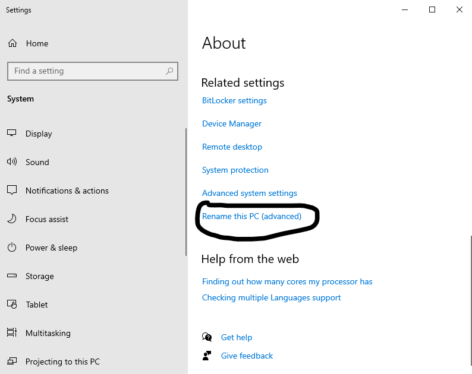
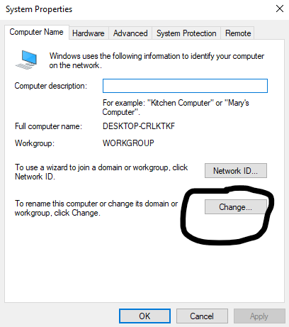
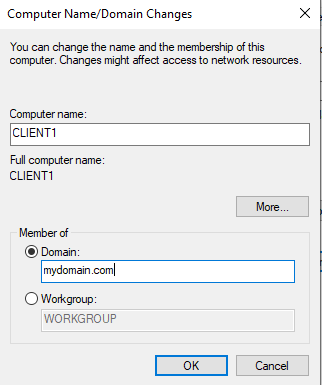
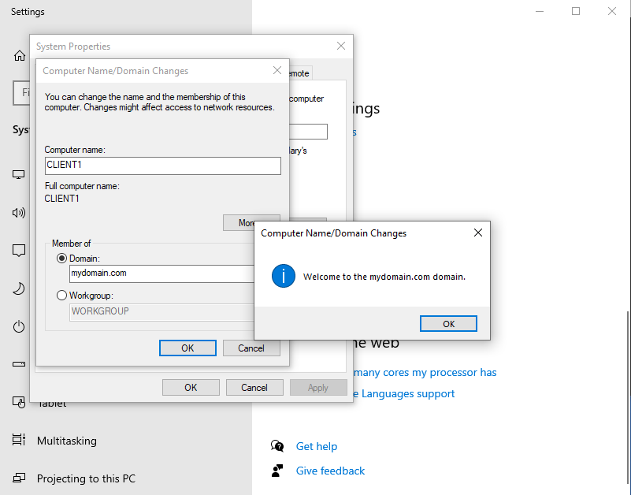
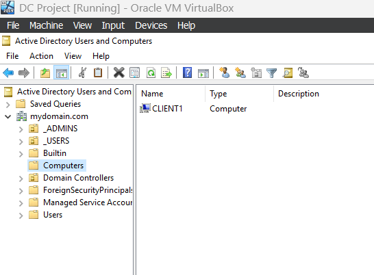
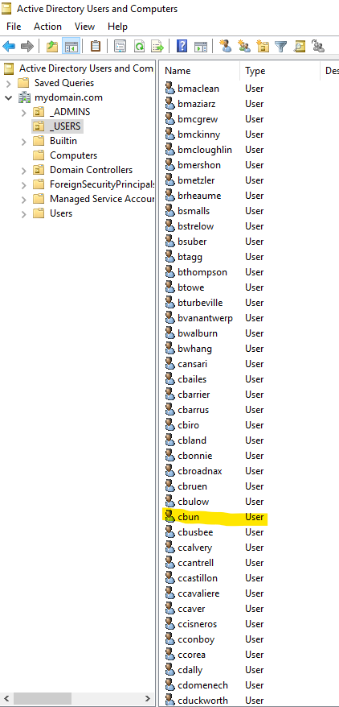
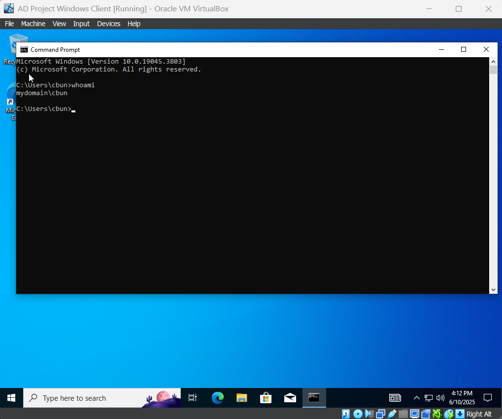

# 🕸️ Client VM Setup & Domain Join

# Client Setup
1. I configured the Windows 10 client VM’s network adapter to be attached to an Internal Network named intnet. This allows it to communicate with the domain controller VM while remaining isolated from my host or internet directly.

2. I installed Windows 10 Pro on the client VM because it supports domain joining and Group Policy, which are essential for Active Directory testing. This is during the initial setup of the OS.

3. After installation, I ran ipconfig and confirmed that the client automatically received an IP address from the DHCP server on the domain controller. It shows the IP 172.16.0.100, subnet mask, and gateway — all assigned correctly.

4. On the domain controller, I verified that the client VM successfully leased the IP 172.16.0.100 from the DHCP scope I configured earlier. This confirms DHCP is working and communicating with the client.

5. I tested connectivity by pinging google.com and mydomain.com. The successful replies show that the client has both internet access via NAT and internal DNS resolution to the domain controller (172.16.0.1). This confirms that both NAT and internal DNS are functioning correctly.

## Joining the Domain

1. I started by opening the “About” settings on my Windows 10 client and clicked on “Rename this PC (advanced)” to bring up the classic System Properties dialog, which is needed for joining the domain.

2. In the System Properties window, I clicked the “Change…” button to open the Computer Name/Domain settings. This is where I could rename the computer and specify the domain to join.

3. I renamed the computer to CLIENT1 and selected the Domain radio button, then typed in mydomain.com, which matches the domain hosted on my domain controller.

4. After entering the domain and authenticating, I received a message confirming: “Welcome to the mydomain.com domain.” This verified that the client VM successfully joined the Active Directory domain.

5. Back on the domain controller, I opened Active Directory Users and Computers (ADUC) and confirmed that CLIENT1 appeared under the Computers container. This proves that the client was registered in the domain.

6. Before logging in, I confirmed that the user cbun existed in the _USERS organizational unit. This account was one of the many I created earlier using the PowerShell script.

7. On the client VM, I logged in using the domain account cbun, and verified it with the whoami command. The output mydomain\cbun confirmed that I was successfully logged into the domain from the client machine.

