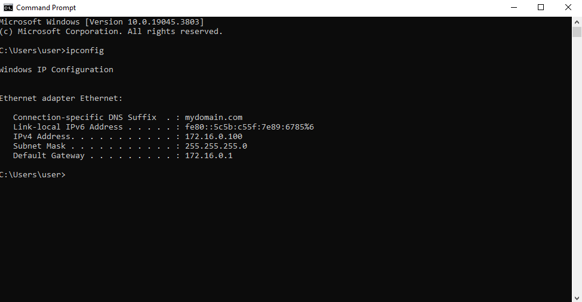

# 🕸️ Client VM Setup & Domain Join

# Client Setup
1. I configured the Windows 10 client VM’s network adapter to be attached to an Internal Network named intnet. This allows it to communicate with the domain controller VM while remaining isolated from my host or internet directly.

2. I installed Windows 10 Pro on the client VM because it supports domain joining and Group Policy, which are essential for Active Directory testing. This is during the initial setup of the OS.

3. After installation, I ran ipconfig and confirmed that the client automatically received an IP address from the DHCP server on the domain controller. It shows the IP 172.16.0.100, subnet mask, and gateway — all assigned correctly.

4. On the domain controller, I verified that the client VM successfully leased the IP 172.16.0.100 from the DHCP scope I configured earlier. This confirms DHCP is working and communicating with the client.

5. I tested connectivity by pinging google.com and mydomain.com. The successful replies show that the client has both internet access via NAT and internal DNS resolution to the domain controller (172.16.0.1). This confirms that both NAT and internal DNS are functioning correctly.

