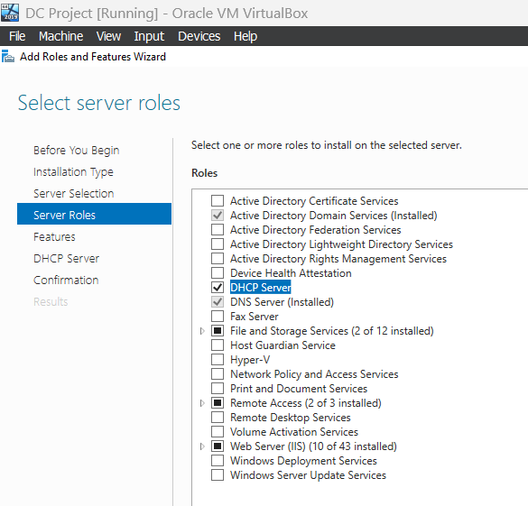
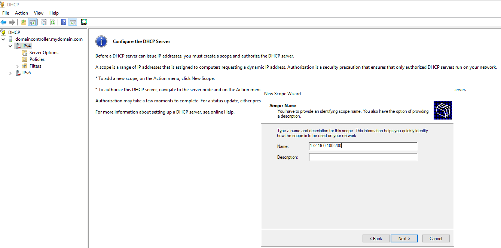
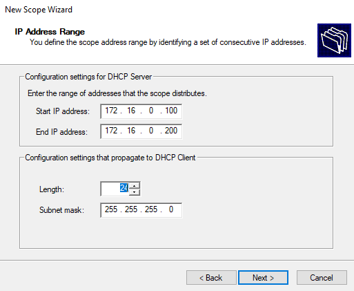
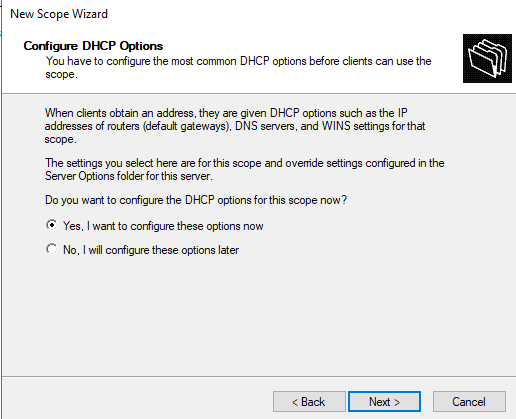
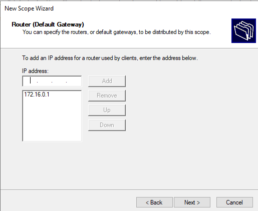
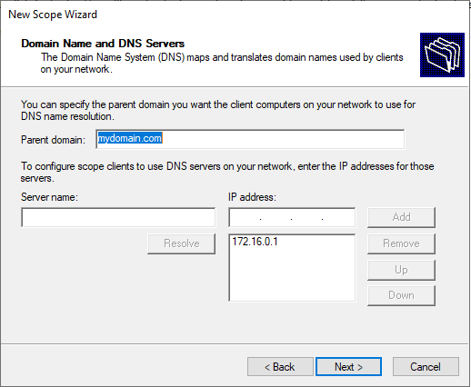
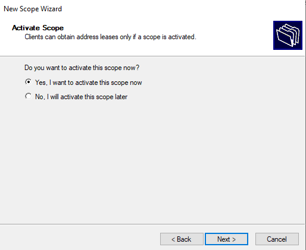
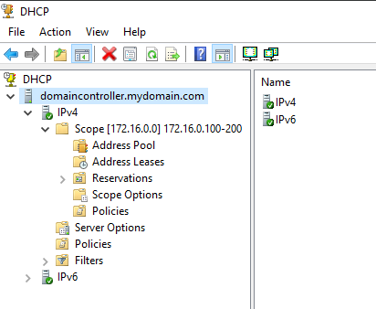

## 🍽️ DHCP Server Setup
This will allow clients on the internal network to get an IP address that will allow them to get on the internet.

<b> 1. DHCP Role Installation </b>
This screen shows the selection of the DHCP Server role during Server Manager’s Add Roles and Features Wizard. This role allows the server to dynamically assign IP configuration to clients on your internal network.

<b> 2. Scope Creation Prompt </b>
After DHCP installation, I opened the DHCP management console and started creating a new scope. The scope defines the IP address range the server will lease to clients. I named the scope using the range 172.16.0.100-200, which will be the pool of addresses available to your internal hosts.

<b> 3. IP Address Range </b>
This window shows defining the Start IP and End IP of your scope:
<li> Start: 172.16.0.100 </li>
<li> End: 172.16.0.200 </li>
This creates a DHCP pool of 101 addresses. The subnet mask (255.255.255.0) confirms this is a /24 subnet.

<b> 4. DHCP Options Setup Prompt </b>
Here, I chose to configure DHCP options immediately. These options include assigning the default gateway and DNS server that clients will use after obtaining an IP address.

<b> 5. Default Gateway </b>
I entered 172.16.0.1 as the default gateway. This is the IP address of the Domain Controller's internal NIC, which also acts as a NAT router (configured earlier using RRAS). Clients will route internet-bound traffic through this address. I configured NAT on the domain controller and the dc has routing configured as well. So, its job is to forward traffic from the clients to the internet. Because of this the clients are going to use the internal nic of the dc as the default gateway/router

<b> 6. DNS Server </b>
The DNS option is set to 172.16.0.1, which points to the Domain Controller's internal IP. We do this because the DC is also the DNS server, responsible for resolving both internal domain names (mydomain.com) and external internet names (via forwarders). When I installed AD DS on the DC, it automatically installs DNS and beause of that we’re going to use the DC as the DNS server. In this case I have to do that anyway or I wont be able to join the domain. After this you may need to right click on the domain, click authorize and click refresh.

<b> 7. Scope Activation </b>

I selected to immediately activate the scope, which means DHCP clients on the internal network can now request and receive leases right away.

## 🏁 Result

