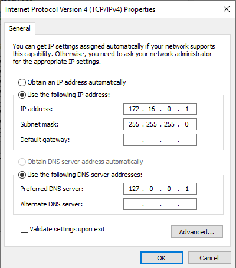
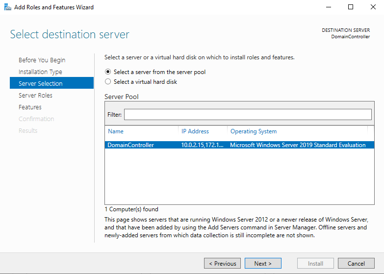
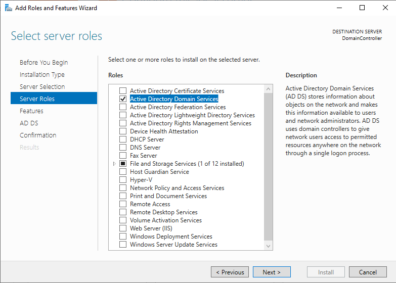
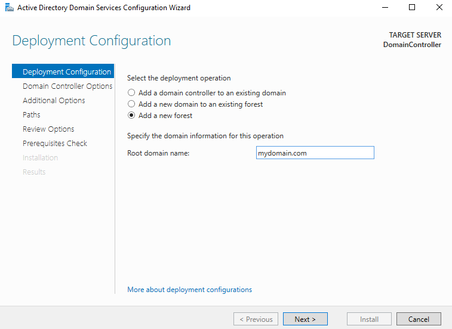
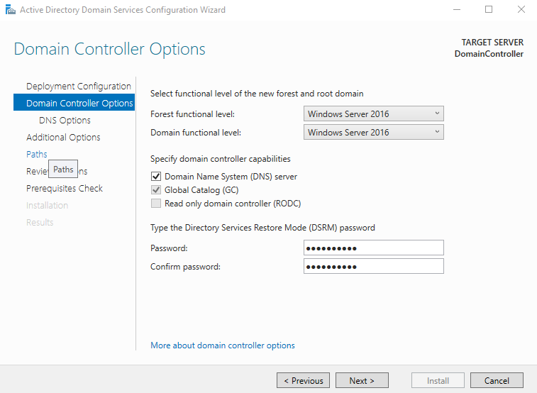
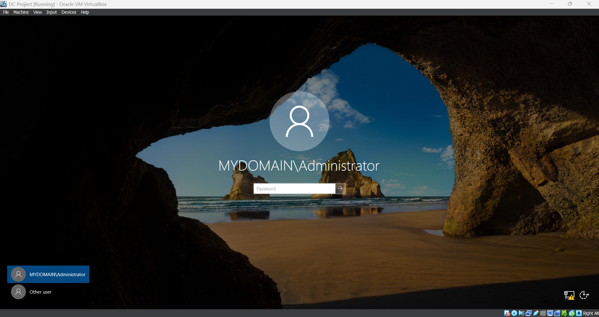

# 🎮 Domain Controller Setup

## VM Setup
After adding the ISO and configuring the necessary hardware specifications for the domain controller VM, I set the first network interface (NIC) to connect to my home internet. This NIC will serve as the external connection. 

Next, I configured a second NIC for internal communication. This NIC is attached to an internal VirtualBox network and will be used to communicate with the client VM.

## Network Configuration
On first boot of the Domain Controller VM, I renamed the NICs for easy identification purposes throughout the project

Next, I set the IPv4 properties for the Internal NIC. Not using a Default gateway because the domain controller itself is going to serve as the default gateway. As far as DNS, when I install Active Directory, it will automatically installs DNS. So, this server will use itself as the DNS server which is why we use the loopback address for the preferred DNS server (I could have put the IP address also).

External NIC will recieves DHCP from home router

## Domain / AD DS Setup
1. After selecting "add roles and features" from the server manager dashboard, I am shown the selection of the local server (DomainController) from the server pool for role installation. This confirms the machine is online, recognized, and ready for role configuration.

2. Server Roles - Displays selection of the Active Directory Domain Services (AD DS) role, which is the foundation of building a domain controller. This step also installs the DNS Server role automatically when selected.

3. Deployment Configuration - Here I selected "Add a new forest", which indicates I’m creating a brand-new Active Directory environment. The root domain name mydomain.com is the base of my domain hierarchy.

4. Domain Controller Options - I chose Windows Server 2016 functional level, enabling newer AD features. DNS and Global Catalog are enabled by default. The Directory Services Restore Mode (DSRM) password is set here for recovery scenarios.

5. After running the install and restarting I am presented with the Login Screen. This is my post-domain-promotion login screen, showing MYDOMAIN\Administrator. It visually confirms that the domain has been created and is operational.

