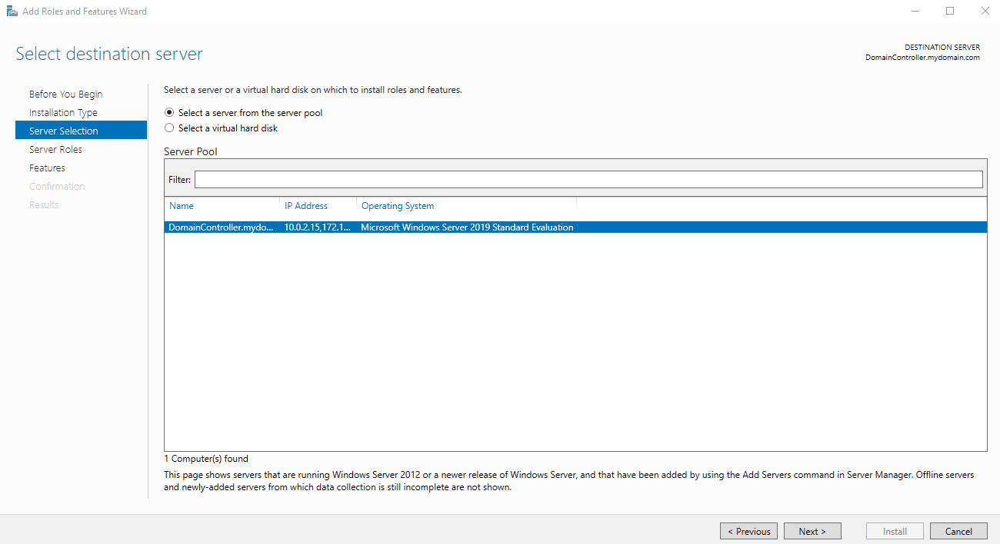
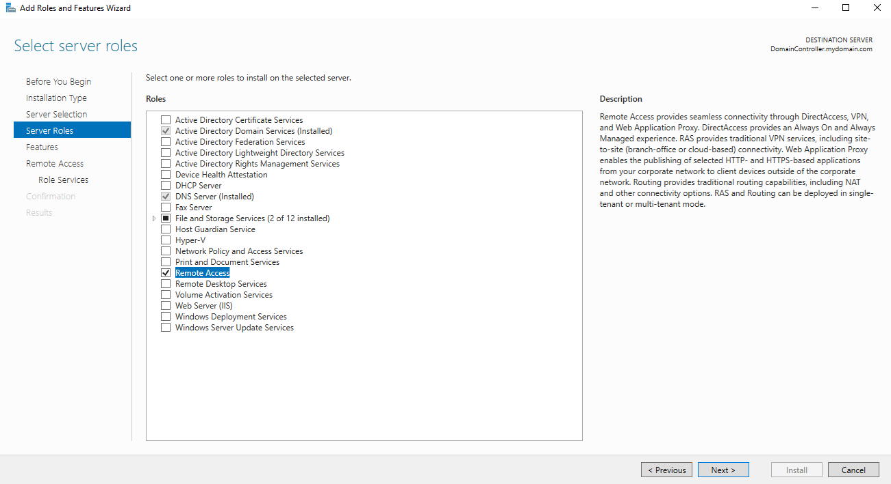
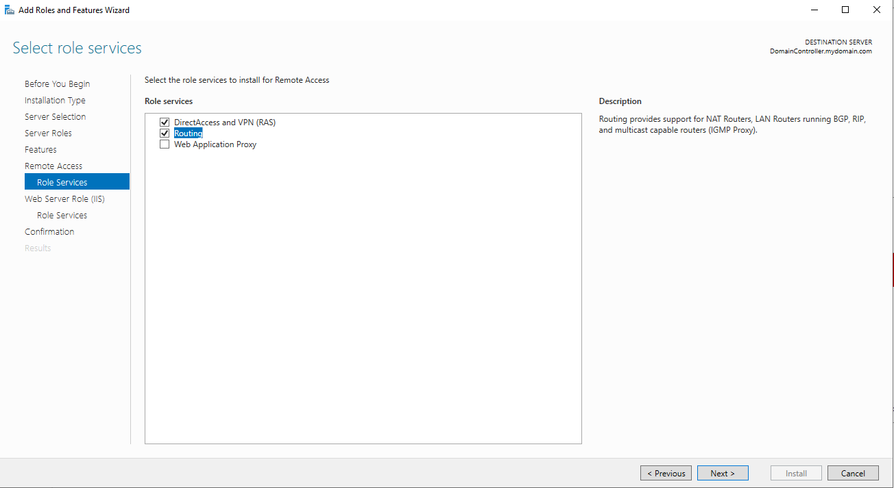
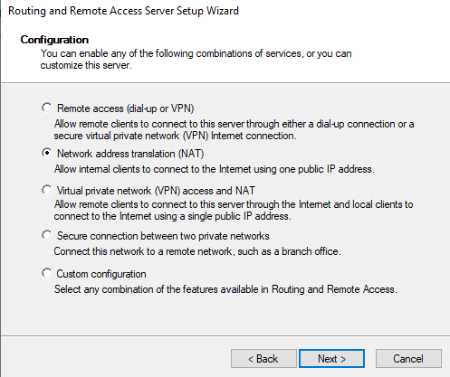
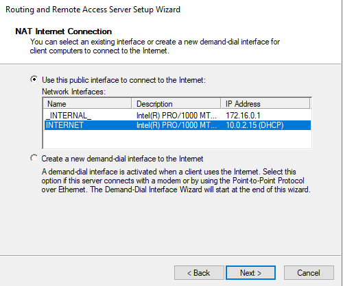
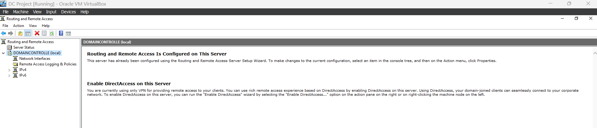

# NAT & Routing Configuration (RRAS)
This setup will allow a client to be on VirtualBox’s internal network while still being able to access the internet through the domain controller. 

<b> 1. Server Selection </b>
 
This screen confirms that the server I am configuring (named DomainController.mydomain.com) is selected from the server pool. This step is required before assigning additional roles like RAS.

<b> 2. Server Roles </b>
 
Here, I selected the Remote Access role, which allows the server to support routing and NAT. This role enables the server to act as a gateway for internal devices that need to access the internet.

<b> 3. Role Services Selection </b>
I chose the Routing and DirectAccess and VPN (RAS) role services. This step allows the server to perform tasks like NAT (Network Address Translation) and forward traffic between interfaces.

<b> 4. RAS Wizard / Service Configuration </b>
In this wizard, I selected the Network Address Translation (NAT) option. This allows my domain controller to route traffic from the internal network (e.g., 172.16.0.0/16) to the internet using its external network adapter.

<b> 5. NAT Internet Connection Selection </b>
This screen lets me choose which interface connects to the public network (Internet). I correctly selected the adapter labeled INTERNET with IP 10.0.2.15, which receives DHCP from my home router. This adapter will perform NAT for traffic coming from the internal network (172.16.0.0/16).

<b> 6. RRAS Admin Console / Routing Configured </b>
This confirms that Routing and Remote Access has been successfully configured. My server is now functioning as a NAT router, enabling devices on the internal network to access external internet resources through the domain controller.

## 🏁 Result
- Client devices on 172.16.0.0/24 can now access the internet. 

