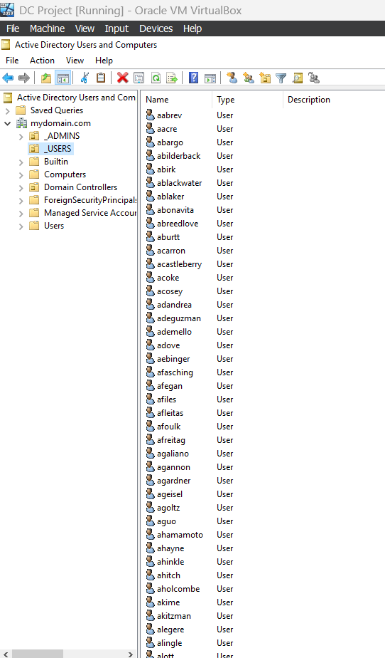
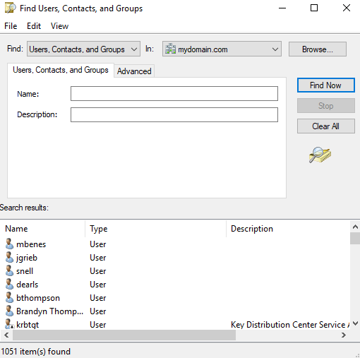

# 💡 User Creation Automation with Powershell
Using a PowerShell script to add 1k sample users in active directory.

## Security Adjustment (for lab purposes only)
First we need to add a configuration that lets us browse the internet from the domain controller. In a production environment we would not want to do this but for the purposes of this lab I am. 

These are the steps for turning off IE Enhanced Security

1.

2.

3. Here, I’ve disabled Internet Explorer Enhanced Security Configuration (ESC) for both Administrators and Users. This is a common step to allow downloading tools or browsing the internet from the server (especially useful during testing), though it reduces security and is not recommended in production. To streamline user creation in Active Directory, I utilized a publicly available PowerShell script and modified it slightly for my environment. The script automatically generated 1,000 users+ and placed them into a designated OU.

4. This is the script I used to automatically create users in Active Directory using a PowerShell .ps1 file. It reads first and last names from a file, generates usernames, sets passwords, and places users in the _USERS organizational unit.

5. This screenshot shows the _USERS OU in Active Directory Users and Computers (ADUC), filled with user accounts that were created from the script. It demonstrates that the automation worked and that the domain is correctly handling and displaying user objects.

6. Here I ran a search in ADUC showing that 1,051 user objects exist in the domain. This is proof that the PowerShell script successfully populated the directory at scale.

